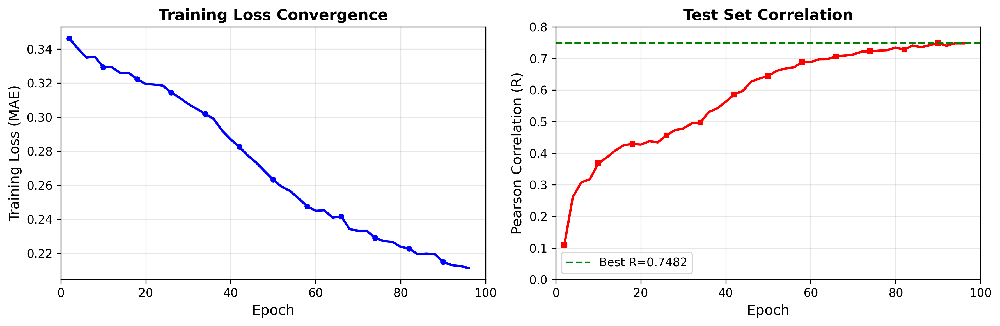

# Predicting Atomic Softness in Metallic Glasses

[](https://www.python.org/downloads/)
[](https://github.com/google/jax)
[](https://pytorch.org/)
[](LICENSE)

**Hybrid Physics-Transformer Neural Network for Unsupervised Prediction of Atomic Softness in Metallic Glasses**

This repository contains the complete implementation of a novel approach to predict atomic softness in metallic glasses using rotation-invariant Hessian features and a hybrid physics-transformer architecture. Our method achieves **R=0.7482** correlation without requiring any labeled rearrangement data from molecular dynamics simulations.



## 🔬 Research Highlights

- **Zero Labeled Data Required**: Predicts softness directly from inherent structure configurations
- **Physics-Informed Features**: Uses local Hessian eigenvalues (cage stiffness) as rotation-invariant descriptors
- **Efficient Training**: Trains in ~2.5 hours on a single NVIDIA Tesla K4 GPU
- **Strong Performance**: Achieves R=0.7482 Pearson correlation on held-out test configurations
- **Data Augmentation**: Novel physics-informed augmentation generates 1,200 training examples from 120 base configurations

## 📊 Key Results

| Metric | Value |
|--------|-------|
| Test Correlation (R) | 0.7482 |
| Test R² | 0.560 |
| Training Loss (MAE) | 0.2114 |
| Training Time | 146 minutes |
| GPU Memory | 11.2 GB |
| Model Parameters | ~850K |

## 🗂️ Repository Structure

```
.
├── generate_glass_data.py          # Single glass configuration generation
├── generate_diverse_data.py        # Generate 120 diverse base configurations
├── augment_data.py                 # Physics-informed data augmentation
├── train.py                        # Hybrid physics-transformer training
├── data/                           # Dataset directory
│   ├── glass_data_000.pkl         # Base configurations (120 files)
│   ├── glass_data_001.pkl
│   ├── ...
│   └── metadata.pkl               # Dataset metadata
├── training_curves.png            # Training visualization
└── README.md                      # This file
```

## 🚀 Quick Start

### Prerequisites

```bash
# Core dependencies
pip install jax jaxlib jax-md
pip install torch torch-geometric
pip install numpy scipy matplotlib tqdm
```

### 1. Generate Glass Configurations

Generate a single test configuration:

```bash
python generate_glass_data.py
```

This creates `glass_data_1k.pkl` with a 1000-atom binary Lennard-Jones glass using the **Quench-and-Crush** protocol:
1. Soft gradient descent (untangling)
2. Hard gradient descent (pre-hardening)
3. Brownian dynamics heating (T=0.44)
4. Brownian dynamics quenching (T=0.0)
5. FIRE minimization (inherent structure)
6. Hessian computation (softness labels)

### 2. Generate Diverse Dataset

Create 120 diverse configurations with varied physics parameters:

```bash
python generate_diverse_data.py
```

This generates configurations with varying:
- Density: ρ ∈ [1.1, 1.3]
- Temperature: T ∈ [0.40, 0.48]
- Quench steps: [3000, 7000]
- Species ratio: [0.75, 0.85]
- Interaction scales: σ, ε ∈ [0.90, 1.10]

Output: `diverse_glass_dataset/glass_data_*.pkl` (120 files)

### 3. Physics-Informed Augmentation

Generate 10 rotated copies per configuration with rotation-invariant physics features:

```bash
python augment_data.py
```

**Key Innovation**: Local Hessian eigenvalues are computed **once** and reused for all rotations since they're rotationally invariant.

Output: `augmented_dataset/aug_*.pkl` (1,200 files)

### 4. Train the Model

```bash
python train.py
```

**Training Features**:
- RAM caching for fast data loading
- Mixed precision (FP16/FP32)
- Gradient accumulation (effective batch size = 16)
- Activation checkpointing for memory efficiency
- ReduceLROnPlateau scheduler
- Strict train/test split at base snapshot level

**Output**: `hybrid_physics_best.pth` (best model checkpoint)

## 🏗️ Architecture Details

### Physics Features

Each atom is described by 5 features:
- **Species one-hot**: [2D] - Binary Lennard-Jones system (A/B)
- **Hessian eigenvalues**: [3D] - Local cage stiffness (λ₁, λ₂, λ₃)

### Model Components

```
Input Features (N × 5)
    ↓
Embedding Layer (Linear → LayerNorm → SiLU → Linear)
    ↓
5× Hybrid Blocks:
    ├─ Physics Branch (Bessel RBF + Cosine Cutoff)
    ├─ Attention Branch (4-head Multi-head Attention)
    └─ Fusion (Learnable gate γ)
    ↓
Prediction Head (LayerNorm → Linear → SiLU → Linear)
    ↓
Softness Prediction (N × 1)
```

### Hybrid Message Passing

Each layer combines two pathways:

**Physics Branch**:
```
φₖ(r) = sin(kπr/rcut) / (r/rcut)  [Bessel basis, k=1...32]
fc(r) = 0.5[cos(πr/rcut) + 1]      [Cosine cutoff]
wᵢⱼ = MLP(φ(rᵢⱼ)) · fc(rᵢⱼ)        [Edge weights]
mᵢⱼᵖʰʸˢ = xⱼ ⊙ wᵢⱼ                 [Physics message]
```

**Attention Branch**:
```
Q, K, V = Linear(x) [4 heads × 32 dim]
αᵢⱼ = softmax(QᵢᵀKⱼ/√d · fc(rᵢⱼ))
mᵢⱼᵃᵗᵗⁿ = Σₕ αᵢⱼʰ · Vⱼʰ
```

**Fusion**:
```
mᵢⱼ = mᵢⱼᵖʰʸˢ + γ · mᵢⱼᵃᵗᵗⁿ
hᵢ⁽ˡ⁺¹⁾ = hᵢ⁽ˡ⁾ + Linear(Σⱼ mᵢⱼ)
```

## 🔬 Physics Background

### Binary Lennard-Jones System

Two-component system with interaction potential:

```
Uᵢⱼ = 4εₛᵢₛⱼ[(σₛᵢₛⱼ/rᵢⱼ)¹² - (σₛᵢₛⱼ/rᵢⱼ)⁶]
```

Parameters:
```
σ = [[1.0  0.8 ]    ε = [[1.0  1.5]
     [0.8  0.88]]        [1.5  0.5]]
```

### Softness Definition

Softness quantifies atomic participation in low-frequency vibrational modes:

```
Sᵢ = Σₖ₌₄¹³ Σα |vₖ(i,α)|²
```

where vₖ are eigenvectors of the Hessian matrix H = ∇²U(R).

### Local Hessian Eigenvalues

For each atom, compute the local Hessian (3×3 matrix):

```
Dᵢ = Σⱼ∈𝒩(i) ∂²Uᵢⱼ/∂rᵢ²
```

Edge contributions from Lennard-Jones:
```
kᵣₐ𝒹 = (24ε/r²)[26(σ/r)¹² - 7(σ/r)⁶]
kₜᵣₐₙₛ = -(24ε/r²)[2(σ/r)¹² - (σ/r)⁶]

Hᵉᵈᵍᵉ = (kᵣₐ𝒹 - kₜᵣₐₙₛ)n⊗n + kₜᵣₐₙₛI
```

**Rotation Invariance**: Eigenvalues of Dᵢ are invariant to global rotations!

## 📈 Training Details

### Data Split Strategy

**Critical Design**: Split at base snapshot level to prevent leakage

```
120 base snapshots → shuffle → 102 train, 18 test
├─ Train: 102 × 10 = 1,020 augmented examples
└─ Test:   18 × 10 =   180 augmented examples
```

All 10 rotations of each base snapshot stay together in train or test.

### Hyperparameters

```python
ARCHITECTURE:
  hidden_dim: 128
  num_layers: 5
  num_heads: 4
  num_rbf: 32
  cutoff: 2.5

TRAINING:
  batch_size: 4
  gradient_accumulation: 4 (effective batch = 16)
  learning_rate: 5e-4
  weight_decay: 1e-5
  optimizer: AdamW
  scheduler: ReduceLROnPlateau(patience=5, factor=0.5)
  gradient_clip: 1.0
  epochs: 200 (converged at ~96)
```

## 💡 Why This Approach Works

### 1. Physics-Informed Features Provide Strong Inductive Bias

Hessian eigenvalues directly encode local mechanical environment:
- **λ₁ (smallest)**: Softest vibrational mode → rearrangement pathway
- **λ₂ (intermediate)**: Secondary compliance
- **λ₃ (largest)**: Stiffest confinement

### 2. Rotation Invariance Enables Efficient Augmentation

Traditional augmentation requires recomputing expensive features. Our approach:
- Compute eigenvalues once: O(N³) [one-time cost]
- Generate rotations: O(N) [cheap geometric transform]
- **10× data multiplication with minimal overhead**

### 3. Hybrid Architecture Balances Interpretability and Expressiveness

- **Physics branch**: Captures known radial structure of atomic interactions
- **Attention branch**: Learns geometric context beyond pairwise distances
- **Learnable fusion**: Model decides how to weight physics vs. learned features

## 🆚 Comparison to Existing Methods

| Approach | Requires Labeled Data? | Typical R | Training Cost |
|----------|------------------------|-----------|---------------|
| Structure Learning (SSL) | ✅ Yes (AQS sims) | 0.6-0.8 | Hours/config |
| Hand-crafted Features | ❌ No | 0.5-0.7 | Low |
| Pure GNNs | ✅ Yes (large datasets) | 0.6-0.75 | High |
| **This Work** | ❌ **No** | **0.7482** | **2.5 hrs total** |

## 📊 Dataset Details

Each `.pkl` file contains:

```python
{
    'positions': np.array([N, 3]),      # Atomic coordinates
    'species': np.array([N]),           # Species labels (0=A, 1=B)
    'box_size': float,                   # Periodic box size
    'softness_score': np.array([N]),    # Ground truth softness
    'eigenvalues': np.array([N, 3]),    # Local Hessian eigenvalues
    'energy': float,                     # Total potential energy
    'parameters': dict                   # Generation parameters (diverse dataset only)
}
```

## 🎯 Future Directions

- [ ] Scale to larger systems (N ~ 10⁴ atoms)
- [ ] Test transferability to other glass formers (Stillinger-Weber, EAM)
- [ ] Extend to finite-temperature activation barriers
- [ ] Validate predictions against actual rearrangement events
- [ ] Implement distributed training for even larger models

## 📄 Citation

If you use this code in your research, please cite:

```bibtex
@article{singh2025glass,
  title={Predicting Atomic Softness in Metallic Glasses using Hybrid Physics-Transformer Architecture with Rotation-Invariant Hessian Features},
  author={Singh, Saurab},
  journal={arXiv preprint},
  year={2025}
}
```

## 📝 License

This project is licensed under the MIT License - see the [LICENSE](LICENSE) file for details.

## 🙏 Acknowledgments

- **JAX-MD**: For physics simulation framework
- **PyTorch Geometric**: For graph neural network infrastructure
- **Kaggle**: For providing free GPU resources

## 📧 Contact

**Saurab Singh** - Independent Researcher

For questions or collaborations, please open an issue on GitHub.

---

**Note**: This research was conducted independently using freely available computational resources. All simulations were run on Kaggle's free tier (NVIDIA Tesla K4, 12GB VRAM).